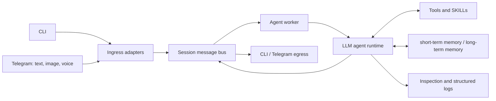

# Mahabot

> A **complete LLM agent harness** built as a side project to study how modern LLM agents orchestrate context, tools, SKILLs, and memory.

Mahabot is an independently implemented **agent harness** inspired by studying the source code of [OpenClaw](https://github.com/openclaw/openclaw) and [Nanobot](https://github.com/HKUDS/nanobot). It is a hands-on learning project—not a fork or a hosted product—built to explore the systems around an LLM that make an agent useful over time.

## Technology Stack

| Area                        | Technologies and design                                                                                                     |
| --------------------------- | --------------------------------------------------------------------------------------------------------------------------- |
| **Runtime/Agent Framework** | **TypeScript**, Node.js `>= 22.5`, `@mariozechner/pi-agent-core`, `@mariozechner/pi-ai`                                    |
| **Interfaces**              | Local CLI; private **Telegram** text, image, and voice conversations through Telegraf                                       |
| **Memory/Context**          | In-process **context**, **SQLite** with WAL, **conversation persistence + restoration**, and **context compaction**         |
| **Agent capabilities**      | **SKILLs**, **tool** registry, workspace-aware filesystem and shell operations, **web search**, and configurable LLM models |
| **Media and observability** | FFmpeg, OpenAI-compatible transcription, structured console/NDJSON logging, and runtime inspection                          |
| **Engineering quality**     | Modular boundaries, safety policies, configuration validation, and 129 automated tests                                     |

## Architecture



The runtime is a local modular monolith. One process owns channel adapters, message routing, agent execution, tools, memory, and observability. Explicit contracts keep channel-specific behavior outside the agent core and make the major subsystems independently testable.

For a code-aligned breakdown of modules, contracts, data flows, failure handling, and invariants, see the [project specification](docs/specs/project_specs.md).

```text
User input
  -> CLI or Telegram ingress
  -> normalized session message
  -> AgentWorker
  -> LLM runtime + tools + SKILLs
  -> memory persistence and runtime events
  -> CLI or Telegram response
```

## Engineering Focus

### 1. LLM Agent Harness

Mahabot implements the application layer around the underlying LLM runtime:

- A channel-neutral message contract connects CLI and Telegram ingress to the same agent worker.
- A session-aware in-memory bus preserves turn ordering and separates user messages, assistant output, and runtime events.
- A central tool registry assembles filesystem, shell, search, inspection, and progress tools under explicit workspace policy.
- Provider and model configuration supports built-in models and custom OpenAI-compatible endpoints.
- Telegram and CLI remain adapters around the agent core instead of leaking channel-specific logic into it.

### 2. SKILLs

SKILLs are treated as discoverable prompt-and-instruction modules rather than hard-coded agent behavior.

- Mahabot loads built-in and workspace-local SKILLs.
- YAML frontmatter is parsed into a typed SKILL catalog.
- SKILL summaries are assembled into the runtime system context alongside user, soul, workspace, and tool instructions.
- The separation makes new task-specific behavior possible without changing the core orchestration loop.

### 3. Memory Management: short-term memory and long-term memory

Mahabot separates active model context from conversation history that must survive process restarts:

- **short-term memory** is maintained as an ordered runtime message window for the active session.
- **long-term memory** stores completed conversation turns in SQLite with WAL mode and transactional appends.
- Startup restoration aligns history to complete user/assistant turn boundaries.
- Token watermarks trigger context compaction while preserving a recent, coherent tail for the model.

Here, long-term memory means durable conversational persistence and restoration rather than a vector-search knowledge base. The design focuses on reliable session continuity and bounded LLM context.

## Additional Engineering Highlights

- **Multimodal Telegram ingress:** photos are buffered until the user supplies text or voice context; voice messages are converted with FFmpeg and transcribed before entering the agent.
- **Tool safety boundaries:** filesystem and shell tools can be restricted to the configured workspace, validate paths, bound execution time, truncate output, and reject known destructive command patterns.
- **Runtime inspection:** Telegram commands can inspect context, agent state, tool events, token usage, and thinking visibility without rewriting persistent configuration.
- **Structured observability:** correlated console and NDJSON events support bounded retention, secret-like field redaction, and graceful flush on shutdown.
- **Context-aware configuration:** each session receives its own workspace, prompt files, SKILLs, configuration, persistence, and logs under `~/.mahabot/`.

## Repository Structure

```text
src/
├── agent/          # Runtime wrapper, worker, tools, SKILLs, and persistence
├── config/         # Session bootstrap, model selection, and validation
├── context/        # System-context and SKILL assembly
├── gateway/        # CLI/Telegram ingress, egress, media, and commands
├── logging/        # Structured console and NDJSON logging
├── messageBus/     # Internal message contracts and session queues
├── onboarding/     # Telegram readiness checks
└── cli.ts          # Command-line entrypoint

docs/specs/          # Detailed code-aligned project specification
tests/              # Unit and integration-style behavior tests
```

## Run Locally

### Prerequisites

- Node.js `>= 22.5.0`
- An API key for the configured LLM provider
- FFmpeg if Telegram voice input is enabled
- A Telegram bot token and Telegram user ID if Telegram mode is enabled

### Install

```bash
git clone https://github.com/Matt1204/mahabot.git
cd mahabot
npm install
cp .env.example .env
```

Add the provider credentials you use to `.env`.

### CLI mode

```bash
npm run cli
```

The first run creates a session workspace and configuration under `~/.mahabot/`. Review the generated `config.json`, then run the command again.

### Telegram mode

```bash
npm run telegram
```

Telegram startup performs onboarding checks and reports the generated config path, required environment variables, and any missing user allowlist settings. After resolving the reported items, rerun the command.

### Verify

```bash
npm test
npm run build
```

## Real-World Use

Mahabot served as a personal assistant throughout preparations for the **2026 Vancouver Marathon**, giving the project a sustained real-world workflow beyond isolated demonstrations.

## Acknowledgements

Mahabot was inspired by studying [OpenClaw](https://github.com/openclaw/openclaw) and [Nanobot](https://github.com/HKUDS/nanobot). It uses `@mariozechner/pi-agent-core` and `@mariozechner/pi-ai` as agent-runtime and model/tool primitives while implementing its own application harness, channel integration, tools, SKILLs, memory, configuration, and observability layers.
