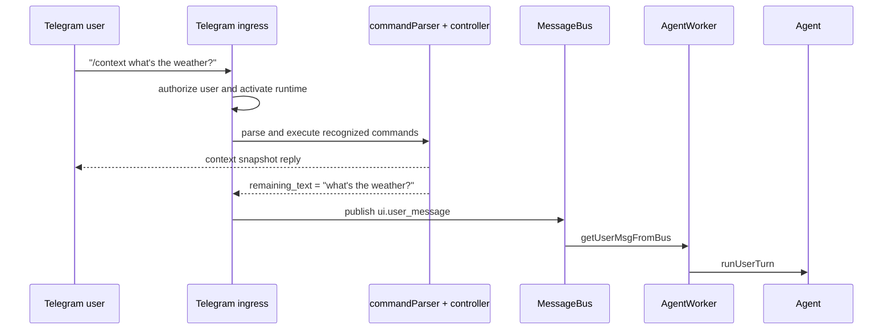

# Runtime Commands Design

## 1. Overview

This design adds a Telegram-only runtime command plane for fixed `/snake_case`
commands. Commands are parsed by ingress before user content enters
`MessageBus`; recognized commands execute against local runtime state and are
removed from the text sent to the agent. Unknown slash commands are logged and
left in the prompt unchanged.

The command layer is intentionally channel-neutral even though only Telegram
uses it in this phase. Future ingress adapters can reuse the same parser,
registry, controller, and runtime state contracts without making `MessageBus` or
`AgentWorker` channel-aware.



## 2. Goals and Non-Goals

Goals:

- Support `/context`, `/agent_state`, `/inspect`, `/inspect_all_on`,
  `/inspect_all_off`, `/inspect_tool_on`, `/inspect_tool_off`,
  `/inspect_thinking_on`, and `/inspect_thinking_off`.
- Allow recognized commands to run while an agent turn is in progress.
- Allow commands to be sent alone or mixed into the leading or trailing command
  region of a user text message.
- Send command replies to the user immediately, before publishing any remaining
  user text to the agent.
- Send one reply message per recognized command.
- Remove recognized commands before publishing the remaining user text to
  `MessageBus`.
- Avoid blocking the agent loop for command-only messages.
- Keep CLI command behavior unchanged.

Non-goals:

- No CLI runtime commands in this phase.
- No durable command history.
- No real-time tokenizer-based context estimation. `/context` reports the last
  known `turn_end` token usage.
- No per-user authorization beyond the existing Telegram whitelist and active
  chat policy.
- No command parsing for voice transcripts or photo captions in this phase.

## 3. Command Syntax

Commands are fixed slash tokens using snake_case:

```text
/context
/agent_state
/inspect
/inspect_all_on
/inspect_all_off
/inspect_tool_on
/inspect_tool_off
/inspect_thinking_on
/inspect_thinking_off
```

Telegram bot suffixes should be accepted:

```text
/context@MyBot
```

Only leading and trailing contiguous command-token regions are parsed.

Examples:

| Input | Recognized commands | Remaining agent text |
| --- | --- | --- |
| `/context` | `/context` | empty |
| `/agent_state` | `/agent_state` | empty |
| `/context what's the weather?` | `/context` | `what's the weather?` |
| `/inspect_tool_on summarize this` | `/inspect_tool_on` | `summarize this` |
| `summarize this /context` | `/context` | `summarize this` |
| `/context summarize this /inspect` | `/context`, `/inspect` | `summarize this` |
| `what is /context in express?` | none | original input |
| `/unknown do something` | none | original input |

Unknown slash commands:

- are not executed;
- do not produce a user-facing reply;
- are logged with `console.log`;
- are kept in the remaining prompt.

[ASSUMPTION] A "command token" is whitespace-delimited. `"/context,"` is not a
command; `"/context"` is. This avoids surprising removals in normal prose.

## 4. Data Models and APIs

### `RuntimeCommandName`

```ts
export type RuntimeCommandName =
  | "context"
  | "agent_state"
  | "inspect"
  | "inspect_all_on"
  | "inspect_all_off"
  | "inspect_tool_on"
  | "inspect_tool_off"
  | "inspect_thinking_on"
  | "inspect_thinking_off";
```

### `ParsedRuntimeCommand`

```ts
export interface ParsedRuntimeCommand {
  name: RuntimeCommandName;
  raw: string;
  source: "leading" | "trailing";
}
```

### `RuntimeCommandParseResult`

```ts
export interface RuntimeCommandParseResult {
  commands: ParsedRuntimeCommand[];
  remainingText: string;
  unknownCommandTexts: string[];
}
```

`remainingText` keeps unknown command text intact. It removes only recognized
leading/trailing commands and normalizes adjacent whitespace.

### `RuntimeEventInspectionConfig`

`RuntimeEventInspectionConfig` is not a full copy of `AppConfig`. It is a small
in-memory runtime config object for event-inspection settings that are safe to
adjust at runtime.

```ts
export interface RuntimeEventInspectionConfigSnapshot {
  useEventInspection: boolean;
  include: EventInspectionIncludeConfig;
  thinking: EventInspectionThinkingConfig;
}

export interface RuntimeEventInspectionConfig {
  getSnapshot(): RuntimeEventInspectionConfigSnapshot;
  setAllEvents(enabled: boolean): RuntimeEventInspectionConfigSnapshot;
  setToolEvents(enabled: boolean): RuntimeEventInspectionConfigSnapshot;
  setThinking(enabled: boolean): RuntimeEventInspectionConfigSnapshot;
}
```

Startup initializes this state from `appConfig.eventInspection`. Command
execution mutates this state only. It does not write `config.json`.

### `RuntimeContextSnapshot`

`Agent` should expose a read-only snapshot method:

```ts
export interface RuntimeContextSnapshot {
  curContextSize: number;
  compactLowWatermarkTokens: number;
  compactHighWatermarkTokens: number;
  runtimeMessageCount: number;
  agentBusy: boolean;
}
```

`curContextSize` comes from the existing `turn_end` usage path in
`MessagePersistenceCoordinator.noteTurnUsage`. It is `0` before the first turn
reports usage.

### `AppliedAgentConfigSnapshot`

`AppliedAgentConfigSnapshot` represents the values actually applied to the
current `Agent` instance. It must be captured from the resolved model and
thinking level when the `Agent` is constructed, not read back from
`ConfigManager`.

```ts
export interface AppliedAgentConfigSnapshot {
  providerName: string;
  modelName: string;
  modelProvider: string;
  modelId: string;
  modelDisplayName: string;
  thinkingLevel: ThinkingLevel;
  supportsImageInput: boolean;
}
```

### `AgentRuntimeLifecycleSnapshot`

```ts
export interface AgentRuntimeLifecycleSnapshot {
  running: boolean;
  agentBusy: boolean;
  runtimeMessageCount: number;
  persistenceEnabled: boolean;
  startupRestoreMessageCount: number;
}
```

`agentBusy` means the current `Agent` is executing one user turn. It does not
include Telegram command execution, pending queue messages, pending images, or
voice transcription.

### `RuntimeCommandAgentStateSnapshot`

```ts
export interface RuntimeCommandAgentStateSnapshot {
  context: RuntimeContextSnapshot;
  appliedConfig: AppliedAgentConfigSnapshot;
  runtime: AgentRuntimeLifecycleSnapshot;
  toolCount: number;
}
```

`toolCount` is enough for `/agent_state`; the command should not list concrete
tool names.

### `RuntimeCommandController`

```ts
export interface RuntimeCommandControllerDeps {
  eventInspectionConfig: RuntimeEventInspectionConfig;
  getContextSnapshot: () => RuntimeContextSnapshot;
  getAgentStateSnapshot: () => RuntimeCommandAgentStateSnapshot;
  logger?: Pick<Console, "log" | "warn">;
}

export interface RuntimeCommandExecutionResult {
  replies: string[];
}

export class RuntimeCommandController {
  execute(commands: ParsedRuntimeCommand[]): RuntimeCommandExecutionResult;
}
```

The controller executes commands synchronously. Each recognized command produces
at most one reply string. If one input contains multiple recognized commands,
the gateway sends each reply as a separate Telegram message in command order.

## 5. Current vs Expected Behavior

### Current Behavior

`MahabotGatewayManager.runInTelegramMode` handles Telegram text by trimming the
entire message and calling `publishTriggeredTelegramMessage`. Every non-empty
text message becomes a `ui.user_message`, including strings such as `/context`.

`EventInspection` receives a static `EventInspectionConfig` instance at
construction time. It checks `useEventInspection`, `showTokenUsage`, `include`,
and `thinking.enabled` while rendering runtime events. There is no runtime API
for changing those settings.

`Agent` tracks context usage indirectly through
`MessagePersistenceCoordinator.noteTurnUsage`, but no public runtime snapshot
API exists. Token usage is only surfaced to users when `showTokenUsage` is
enabled.

### Expected Behavior

`MahabotGatewayManager.runInTelegramMode` should parse recognized commands from
Telegram text after authorization and runtime activation, before pending image
consumption and before `publishTriggeredTelegramMessage`.

For command-only input, gateway executes commands and returns without publishing
to `MessageBus`.

For mixed input, gateway executes commands and publishes only `remainingText`.
Pending images should be consumed only if `remainingText` is non-empty and is
published to the agent. A command-only message must not flush pending images.

Unknown commands are logged and remain in the prompt. If no recognized commands
are found, behavior is unchanged except for the console log.

`EventInspection` should read a snapshot from `RuntimeEventInspectionConfig`
each time it processes an event. This lets `/inspect_*` commands affect
subsequent events without rebuilding the agent.

`Agent` should expose runtime context metadata for `/context` without requiring
the command layer to inspect `agentRuntime.state` directly.

## 6. Implementation Details

### Files to Add

`src/gateway/commands/commandParser.ts`

- Export `parseRuntimeCommands(text: string, options?: { botUsername?: string })`.
- Parse only leading and trailing contiguous slash-token regions.
- Recognize optional Telegram suffix `@BotName`.
- Preserve unknown slash commands in `remainingText`.
- Log unknown commands outside parser; parser returns data only.

Parsing pseudocode:

```ts
function parseRuntimeCommands(text) {
  const tokens = tokenizeWithWhitespace(text.trim());
  const leading = scanForwardWhileCommandLike(tokens);
  const trailing = scanBackwardWhileCommandLike(tokens after leading);

  const recognized = [];
  const unknown = [];
  const removeTokenIndexes = new Set();

  for each token in leading + trailing:
    const normalized = normalizeCommandToken(token);
    if recognizedCommand(normalized):
      recognized.push(command);
      removeTokenIndexes.add(token.index);
    else if looksLikeSlashCommand(token):
      unknown.push(token.raw);

  return {
    commands: recognized,
    remainingText: rebuildWithout(removeTokenIndexes),
    unknownCommandTexts: unknown,
  };
}
```

`src/gateway/commands/runtimeEventInspectionConfig.ts`

- Export `createRuntimeEventInspectionConfig(initialConfig: EventInspectionConfig)`.
- Deep clone include/thinking fields on initialization and snapshot reads.
- `setAllEvents(true)` enables all `include` events and
  `useEventInspection`; it does not enable thinking.
- `setAllEvents(false)` disables `useEventInspection` and all `include` events;
  it does not change `thinking.enabled`.
- `setToolEvents(enabled)` updates `tool_execution_start`,
  `tool_execution_update`, and `tool_execution_end`; when enabled, it also sets
  `useEventInspection = true`.
- `setThinking(enabled)` toggles only `thinking.enabled`.

`src/gateway/commands/runtimeCommandController.ts`

- Map command names to state reads/writes and formatted replies.
- `/context` formats `RuntimeContextSnapshot`.
- `/agent_state` formats context, applied agent config, runtime lifecycle,
  tool count, and current event inspection config.
- `/inspect` formats inspection state.
- Multiple commands produce multiple reply strings.

`src/gateway/commands/index.ts`

- Re-export public command types and factories.

### Files to Update

`src/agent/inspection/eventInspection.ts`

- Replace direct static config access with a snapshot provider:

```ts
export interface EventInspectionDeps {
  publishStatus: AgentRuntimeStatusPublisher;
  getInspectionConfig: () => EventInspectionConfig;
  logger?: Pick<Console, "debug" | "warn" | "error">;
  getContextWatermarks?: () => ContextWatermarks | undefined;
}
```

- `processEvent` and `processThinkingEvent` should call
  `const config = this.getInspectionConfig()` and use that local snapshot for
  the whole event.

`src/agent/agent.ts`

- Track whether a turn is currently executing:

```ts
private activeTurnCount = 0;
```

- Increment/decrement around `executeInboundTurn` or the `runExclusive` body.
- Expose:

```ts
getRuntimeContextSnapshot(): RuntimeContextSnapshot
```

- Delegate context usage to `MessagePersistenceCoordinator.getContextBudgetSnapshot`.
  If persistence is disabled, return `0` for context size and `0` for unavailable
  watermarks.
- Capture and expose `AppliedAgentConfigSnapshot` from the resolved model and
  thinking level.
- Expose `AgentRuntimeLifecycleSnapshot` from the current `Agent` instance.

`src/agent/persistence/messagePersistenceCoordinator.ts`

- Keep `getContextBudgetSnapshot()` as the source for last token usage.
- Keep `curContextSize = 0` before first usage. `/context` should render this as
  the current known runtime value, not as an unknown/null state.

`src/gateway/manager.ts`

- During `buildSessionRuntime`, create one `RuntimeEventInspectionConfig` for the
  session and pass `getSnapshot` to `EventInspection`.
- Add `eventInspectionConfig` and `commandController` to `TelegramSessionRuntime`.
- In the Telegram text branch:
  - parse commands from `ctx.message.text`;
  - `console.log` each `unknownCommandTexts` entry;
  - execute recognized commands;
  - immediately `ctx.reply` once per command reply, before publishing any
    remaining text to `MessageBus`;
  - if `remainingText.trim()` is empty, return;
  - call `publishTriggeredTelegramMessage` with `remainingText`.

### Test Plan

Add `tests/gateway/commandParser.test.ts`:

- parses single command-only input;
- parses `/agent_state`;
- parses leading command plus prompt;
- parses trailing command plus prompt;
- parses both leading and trailing commands;
- does not parse command-like token in the middle;
- accepts Telegram bot suffix;
- keeps unknown command in remaining text;
- does not remove punctuation-adjacent slash text.

Add `tests/gateway/runtimeEventInspectionConfig.test.ts`:

- initializes from config;
- `inspect_all_on` enables all event includes but not thinking;
- `inspect_all_off` disables normal event inspection and does not change
  thinking;
- tool commands affect only tool events;
- thinking commands affect only `thinking.enabled`.

Add controller tests:

- `/context` formats `curContextSize`, including `0` before first usage;
- `/agent_state` formats context, applied config, runtime lifecycle, tool
  count, and inspection config;
- `/inspect` formats current state;
- multiple commands produce multiple separate replies.

Update `tests/eventInspection.test.ts`:

- verify event inspection reads updated snapshot after construction.

Add or update Telegram manager-level tests only if the project already has
testable manager seams. If not, keep integration behavior covered by parser,
state, controller, and ingress adapter unit tests.

## 7. Evaluation of Proposed Alternatives

### 7.1 Global Mutable Full Config State

Proposal: Load `config.json` once into a shared global full config object. All
runtime code reads this shared object. `/command` mutates the in-memory object
and writes the new value back to `config.json`.

Benefits:

- One apparent source of truth for static and runtime config.
- Runtime changes survive restart if file writes succeed.
- Future commands that modify config do not need a second state model.

Costs and risks:

- It blurs static startup config and live runtime control. Many current config
  fields are consumed only during construction: model selection, credentials,
  tools, prompt assembly, Telegram runtime settings, media settings, and
  watermarks. Mutating those fields later may not affect already-constructed
  objects, creating a misleading "global config says X, runtime is still Y"
  state.
- File writes from Telegram commands add failure paths to a latency-sensitive
  ingress path. A failed write would need rollback semantics for the in-memory
  state or explicit "memory changed but disk did not" behavior.
- Persisting command changes can surprise users after restart. Temporary
  debugging choices like event inspection are usually session-scoped.
- A global mutable object encourages hidden dependencies. Components can start
  reading config at arbitrary times, making behavior harder to reason about and
  test.
- Concurrency is simple today because Telegram handling is serialized, but
  future ingress adapters or hosted runtimes would need locking/versioning for
  file writes and config snapshots.

Recommendation:

Do not introduce a global mutable full config for this feature. Use a small
runtime state object for session-scoped live inspection controls.

For future durable runtime parameter changes, use an explicit config mutation
and reload architecture instead of letting all code freely read and mutate one
global object. The safer shape is:

```text
config.json
  -> ConfigManager load/validate
  -> AppConfigState current snapshot
  -> runtime command mutates allowlisted fields through ConfigMutationService
  -> ConfigMutationService validates and atomically writes config.json
  -> AgentRuntimeReloader rebuilds the affected runtime components from the
     updated AppConfigState snapshot
```

In that design, a command such as changing model thinking effort should not rely
on existing runtime objects noticing a mutated config object. It should perform
two explicit operations:

1. Mutate durable config through an allowlisted, validated command path.
2. Trigger an agent runtime reload that rebuilds the components that consume
   that config at construction time.

This makes the semantics observable: after a successful reply, the user knows
whether the config was saved, whether the agent runtime was reloaded, and
whether a restart is still required.

Challenge:

If "all code reads one live config object" becomes a goal, the system should be
designed around reactive reconfiguration. That is a larger architecture change:
components need to declare which settings are hot-reloadable, which require
agent reload, which require gateway reload, and which require process restart.
Without that classification, global mutable config will produce ambiguous
runtime behavior.

Recommended future classification:

| Config class | Example | Apply strategy |
| --- | --- | --- |
| Hot runtime state | event inspection include flags | mutate in-memory runtime state |
| Agent reload | model, thinking effort, system prompt inputs, tool set | save config, stop/rebuild `Agent` and `AgentWorker` |
| Gateway reload | Telegram bot token, allowed users, media settings | save config, restart Telegram gateway |
| Process restart | Node/runtime-level behavior | save config, require restart |

### 7.2 Parse Leading and Trailing Command Regions

Proposal: Parse commands only in contiguous command-token regions at the start
or end of a message.

Benefits:

- Supports natural Telegram usage:
  - `/context what's the weather?`
  - `what's the weather? /context`
- Avoids parsing slash text in the middle of normal prose, code, paths, URLs, or
  API names.
- Keeps parsing deterministic and explainable.

Costs and risks:

- Users cannot place commands arbitrarily in the middle:
  - `summarize /context this` will not execute `/context`.
- Requires careful tokenization to preserve unknown slash commands and prompt
  whitespace.

Recommendation:

Adopt this rule. It gives useful flexibility without making normal prompt text
fragile.

### 7.3 `inspect_all_on` Excludes Thinking

Decision: `/inspect_all_on` should not enable thinking. `/inspect_thinking_on`
is the only command that enables thinking output.

Benefits:

- Thinking output has a different privacy and noise profile than ordinary tool
  and lifecycle event inspection.
- Users can turn on broad operational visibility without exposing reasoning-like
  text.
- This matches the principle of least surprise for a command named "inspect all"
  in a runtime operations context.

Cost:

- The word "all" is slightly imprecise.

Recommendation:

Keep the behavior and document `/inspect_all_on` as "all standard runtime events,
excluding thinking." If this feels too ambiguous later, rename to
`/inspect_events_all_on` before release.

## 8. Risks and Open Questions

Recommendation: Keep command reply formatting plain text. Telegram egress
formatting is designed for agent output, while command replies are short and do
not need Markdown/HTML conversion.

Decision: Command replies are sent immediately. When a mixed message contains
recognized commands plus remaining prompt text, the gateway sends command
replies before publishing the prompt to `MessageBus`.

Decision: One command produces one reply message. Multiple recognized commands
in one user message produce multiple Telegram replies in command order.

Recommendation: Do not consume pending images for command-only messages.
`publishTriggeredTelegramMessage` currently drains pending images, so command
handling must happen before that call and return early when `remainingText` is
empty.

Code Concern: `EventInspection.processThinkingEvent` currently reads inspection
configuration separately from the later main-event filtering path. When changing
to a snapshot provider, use one snapshot per event to avoid one event being
processed partly under old config and partly under new config.

Decision: `MessagePersistenceCoordinator.curContextSize` may remain `0` before
the first turn reports token usage. `/context` should report `curContextSize: 0`
in that state.

Decision: `/inspect_all_off` does not affect thinking. Thinking visibility is
controlled only by `/inspect_thinking_on` and `/inspect_thinking_off`.
